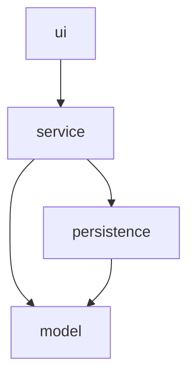

# GameZone Unicesar
GameZone Unicesar is a console-based software solution designed to manage inventory, customer data, and sales transactions for a video game store. Developed as a solution for the workshop 2 - Programación de Computadores III (SS462), Ingeniería de Sistemas, Universidad Popular del Cesar.

## Technologies Used
* **Java:** JDK 26
* **Build Tool:** Maven
* **IDE:** IntelliJ IDEA
* **Version Control:** Git & GitHub (Git Flow methodology)

## Architecture

The `com.gamezone` codebase is structured into four separate layers governed by a strict, single-direction dependency flow: `ui → service → persistence → model`. Under this design, `model` operates independently with zero dependencies, `persistence` links exclusively to `model`, `service` integrates both `model` and `persistence`, and `ui` connects only to `service`. Additional details and architectural justifications can be found in [docs/layers-diagram.md](docs/layers-diagram.md).



## Requirements

- Java 26 or later
- Maven 3.9 or later
- GitHub CLI (`gh`) — only for reproducing the workflow used to build this repository

## Build

```
mvn clean compile
```

## Run

```
mvn exec:java "-Dexec.mainClass=com.gamezone.Main"
```

Data files under `data/` are created and updated automatically. The file `data/sellers.csv` is preloaded with 3 sellers.

## Repository Structure

```
GameZoneUnicesar/
├── README.md
├── TEAM.md
├── pom.xml
├── .gitignore
├── src/
│   └── main/
│       └── java/
│           └── com/
│               └── gamezone/
│                   ├── model/
│                   ├── persistence/
│                   ├── service/
│                   ├── ui/
│                   └── Main.java
├── data/
└── docs/
    ├── analysis.md
    ├── hierarchy-diagram.md
    ├── class-diagram.md
    ├── layers-diagram.md
    └── ai-usage/
        ├── leader-ai-log.md
        ├── developer1-ai-log.md
        └── developer2-ai-log.md
```

## Team Members

See [TEAM.md](TEAM.md) for roles, module ownership, and committed activities.

## Design Documentation

- [Analysis](docs/analysis.md)
- [Hierarchy Diagram](docs/hierarchy-diagram.md)
- [Class Diagram](docs/class-diagram.md)
- [Layers Diagram](docs/layers-diagram.md)

## AI Usage Logs

- [Technical Lead](docs/ai-usage/leader-ai-log.md)
- [Developer 1](docs/ai-usage/developer1-ai-log.md)
- [Developer 2](docs/ai-usage/developer2-ai-log.md)

## Authors

- [@sergioaguerrero](https://www.github.com/sergioaguerrero)
- [@IDMattos](https://github.com/IDMattos)
- [@jhonatandgalindo](https://github.com/jhonatandgalindo)
