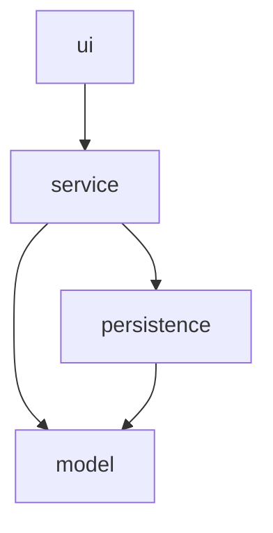

# GameZone Unicesar
GameZone Unicesar is a console-based software solution designed to manage inventory, customer data, sales transactions, and promotional campaigns for a video game store. Developed as a solution for the workshop 2 (and extended for the First Term Exam) - Programación de Computadores III (SS462), Ingeniería de Sistemas, Universidad Popular del Cesar.

## Features
- **Inventory Management:** Register and manage video games, consoles, and accessories.
- **Person Management:** Track customers and sellers.
- **Sales Transactions:** Process sales with automatic stock updates and generated receipts.
- **Promotions Management:** Apply automatic discounts based on active promotional campaigns (Percentage, Category, and Bulk Purchase discounts) to automatically offer the best price to the customer.
- **Returns Management (New):** Register product returns enforcing business rules (30-day deadline, sale ownership), restoring stock, generating receipts, and querying the monthly net balance (Sales - Returns).

## Technologies Used
* **Java:** JDK 26
* **Build Tool:** Maven
* **IDE:** IntelliJ IDEA
* **Version Control:** Git & GitHub (Git Flow methodology)

## Architecture

The `com.gamezone` codebase is structured into four separate layers governed by a strict, single-direction dependency flow: `ui → service → persistence → model`. Under this design, `model` operates independently with zero dependencies, `persistence` links exclusively to `model`, `service` integrates both `model` and `persistence`, and `ui` connects only to `service`. Additional details and architectural justifications can be found in [docs/layers-diagram.md](docs/layers-diagram.md).


```mermaid
flowchart TD
    UI["ui"] --> SERVICE["service"]
    SERVICE --> PERSISTENCE["persistence"]
    SERVICE --> MODEL["model"]
    PERSISTENCE --> MODEL
```

## Requirements

- Java 26 or later
- Maven 3.9 or later
- GitHub CLI (`gh`) — only for reproducing the workflow used to build this repository

## Build

```
mvn clean compile
```

## Run

```
mvn exec:java "-Dexec.mainClass=com.gamezone.Main"
```

### Using the warranty module

1. In **Gestión de ventas → Registrar venta**, for each console added the system asks whether to add an extended warranty. The basic warranty is always generated automatically. The receipt shows the extended warranty cost and the sale id.
2. In **Gestión de garantías** you can: look up the warranty of a product in a sale (sale id + product id), list all warranties, list the ones valid today, and list the ones expiring within a number of days you choose.

Data files under `data/` are created and updated automatically. `data/sales.csv` now uses the format `id,date,customerId,sellerId,items,extendedWarrantyCost` (old lines without id are migrated automatically on the next save). The file `data/sellers.csv` is preloaded with 3 sellers, and `data/promotions.csv` is preloaded with 3 promotional campaigns.

## Repository Structure

```
GameZoneUnicesar/
├── README.md
├── TEAM.md
├── pom.xml
├── .gitignore
├── src/
│   └── main/
│       └── java/
│           └── com/
│               └── gamezone/
│                   ├── model/
│                   ├── persistence/
│                   ├── service/
│                   ├── ui/
│                   └── Main.java
├── data/
└── docs/
    ├── analysis.md
    ├── accessory-analysis.md
    ├── promotion-analysis.md
    ├── hierarchy-diagram.md
    ├── class-diagram.md
    ├── layers-diagram.md
    ├── warranty-analysis.md
    ├── warranty-class-diagram.md
    └── ai-usage/
        ├── leader-ai-log.md
        ├── developer1-ai-log.md
        └── developer2-ai-log.md
```

## Team Members

See [TEAM.md](TEAM.md) for roles, module ownership, and committed activities.

## Design Documentation

- [Analysis](docs/analysis.md)
- [Promotion Analysis](docs/promotion-analysis.md)
- [Return Analysis (New)](docs/return-analysis.md)
- [Hierarchy Diagram](docs/hierarchy-diagram.md)
- [Class Diagram](docs/class-diagram.md)
- [Promotion Class Diagram](docs/promotion-class-diagram.md)
- [Return Class Diagram (New)](docs/return-class-diagram.md)
- [Layers Diagram](docs/layers-diagram.md)
- [Warranty Analysis (New)](docs/warranty-analysis.md)
- [Warranty Class Diagram (New)](docs/warranty-class-diagram.md)

## AI Usage Logs

- [Technical Lead](docs/ai-usage/leader-ai-log.md)
- [Developer 1](docs/ai-usage/developer1-ai-log.md)
- [Developer 2](docs/ai-usage/developer2-ai-log.md)

## Authors

- [@sergioaguerrero](https://www.github.com/sergioaguerrero)
- [@IDMattos](https://github.com/IDMattos)
- [@jhonatandgalindo](https://github.com/jhonatandgalindo)