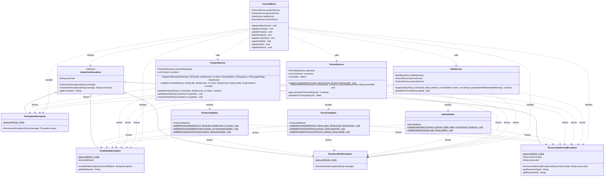

```mermaid
classDiagram
    %% Exception Hierarchy
    class GameZoneException {
        <<abstract>>
        -String errorCode
        +GameZoneException(String message)
        +GameZoneException(String message, String errorCode)
        +getErrorCode() String
    }

    class ResourceNotFoundException {
        +String ERROR_CODE$
        -String resourceType
        -String resourceId
        +ResourceNotFoundException(String resourceType, String resourceId)
        +getResourceType() String
        +getResourceId() String
    }

    class BusinessRuleException {
        +String ERROR_CODE$
        +BusinessRuleException(String message)
    }

    class InvalidDataException {
        +String ERROR_CODE$
        -String fieldName
        +InvalidDataException(String fieldName, String description)
        +getFieldName() String
    }

    class PersistenceException {
        +String ERROR_CODE$
        +PersistenceException(String message, Throwable cause)
    }

    %% Inheritance in Exception Hierarchy
    GameZoneException <|-- ResourceNotFoundException
    GameZoneException <|-- BusinessRuleException
    GameZoneException <|-- InvalidDataException
    GameZoneException <|-- PersistenceException

    %% Static Validation Classes
    class ProductValidator {
        -ProductValidator()
        +validateProductData(String id, String title, double price, int stock)$ void
        +validateStockAvailability(Product product, int requestedQuantity)$ void
        +validateProductExists(Product product, String productId)$ void
    }

    class PersonValidator {
        -PersonValidator()
        +validatePersonData(String id, String name, String email, String phone)$ void
        +validatePersonExists(Person person, String personId)$ void
        +validateUniquePerson(List~Person~ existing, String newId)$ void
    }

    class SaleValidator {
        -SaleValidator()
        +validateSaleData(Customer customer, Seller seller, List~Product~ products)$ void
        +validateSaleExists(Sale sale, String saleId)$ void
    }

    %% Service Layer Classes
    class ProductService {
        -ProductRepository productRepository
        -List~Product~ products
        +registerVideoGame(String id, String title, double price, int stock, String platform, String genre, String ageRating) VideoGame
        +registerConsole(String id, String title, double price, int stock, String brand, String model, int generation) Console
        +updateProduct(String id, String title, double price, int stock) boolean
        +updateStock(String productId, int quantity) void
        +restoreStock(String productId, int quantity) void
    }

    class PersonService {
        -PersonRepository repository
        -List~Customer~ customers
        -List~Seller~ sellers
        +registerCustomer(String name, String phone, String id, String mail) void
        +registerSeller(String name, String phone, String id, String employeeCode, String workShift) void
        +getCustomerOrThrow(String id) Customer
        +getSellerOrThrow(String id) Seller
    }

    class SaleService {
        -SaleRepository saleRepository
        -PersonService personService
        -ProductService productService
        +registerSale(String customerId, String sellerId, List~SaleItem~ items, List~String~ productIdsWithExtendedWarranty) boolean
        +getSaleOrThrow(String saleId) Sale
    }

    %% Presentation / UI Layer
    class ConsoleMenu {
        -ProductService productService
        -PersonService personService
        -SaleService saleService
        -ReturnService returnService
        -registerVideoGame() void
        -registerConsole() void
        -updateProduct() void
        -deleteProduct() void
        -registerCustomer() void
        -registerSeller() void
        -registerSale() void
        -registerReturn() void
    }

    %% Relationships: Services invoke Validators
    ProductService ..> ProductValidator : invokes
    PersonService ..> PersonValidator : invokes
    SaleService ..> SaleValidator : invokes

    %% Relationships: Validators throw Custom Exceptions
    ProductValidator ..> InvalidDataException : throws
    ProductValidator ..> BusinessRuleException : throws
    ProductValidator ..> ResourceNotFoundException : throws

    PersonValidator ..> InvalidDataException : throws
    PersonValidator ..> BusinessRuleException : throws
    PersonValidator ..> ResourceNotFoundException : throws

    SaleValidator ..> InvalidDataException : throws
    SaleValidator ..> BusinessRuleException : throws
    SaleValidator ..> ResourceNotFoundException : throws

    %% Relationships: Services throw / propagate Exceptions
    ProductService ..> InvalidDataException : throws
    ProductService ..> BusinessRuleException : throws
    ProductService ..> ResourceNotFoundException : throws
    ProductService ..> PersistenceException : throws

    PersonService ..> InvalidDataException : throws
    PersonService ..> BusinessRuleException : throws
    PersonService ..> ResourceNotFoundException : throws
    PersonService ..> PersistenceException : throws

    SaleService ..> InvalidDataException : throws
    SaleService ..> BusinessRuleException : throws
    SaleService ..> ResourceNotFoundException : throws
    SaleService ..> PersistenceException : throws

    %% Relationships: ConsoleMenu calls Services and catches Exceptions
    ConsoleMenu ..> ProductService : calls
    ConsoleMenu ..> PersonService : calls
    ConsoleMenu ..> SaleService : calls

    ConsoleMenu ..> GameZoneException : catches
    ConsoleMenu ..> ResourceNotFoundException : handles
    ConsoleMenu ..> BusinessRuleException : handles
    ConsoleMenu ..> InvalidDataException : handles
    ConsoleMenu ..> PersistenceException : handles
```
