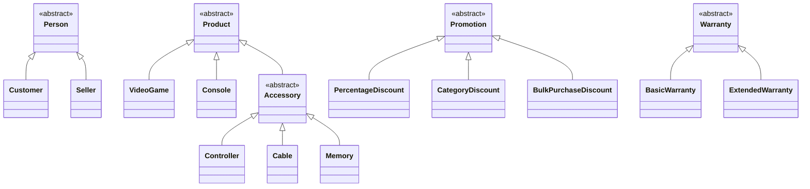

```mermaid

classDiagram
direction TB

    class Person {
        <<abstract>>
    }
    class Customer
    class Seller

    class Product {
        <<abstract>>
    }
    class VideoGame
    class Console
    class Accessory {
        <<abstract>>
    }
    class Controller
    class Cable
    class Memory

    class Promotion {
        <<abstract>>
    }
    class PercentageDiscount
    class CategoryDiscount
    class BulkPurchaseDiscount

    class Warranty {
        <<abstract>>
    }
    class BasicWarranty
    class ExtendedWarranty

    Person <|-- Customer
    Person <|-- Seller

    Product <|-- VideoGame
    Product <|-- Console
    Product <|-- Accessory

    Accessory <|-- Controller
    Accessory <|-- Cable
    Accessory <|-- Memory

    Promotion <|-- PercentageDiscount
    Promotion <|-- CategoryDiscount
    Promotion <|-- BulkPurchaseDiscount

    Warranty <|-- BasicWarranty
    Warranty <|-- ExtendedWarranty
```