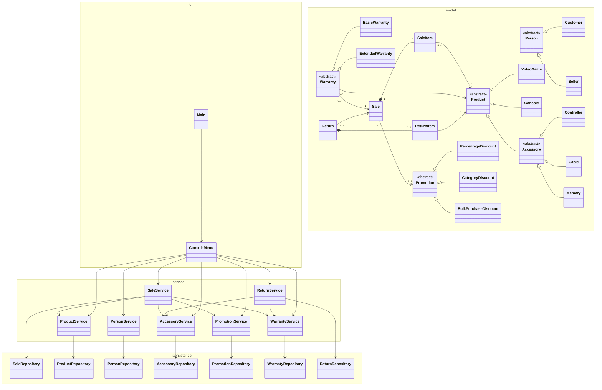

```mermaid

classDiagram
    namespace ui {
        class Main
        class ConsoleMenu
    }

    namespace service {
        class SaleService
        class ProductService
        class PersonService
        class AccessoryService
        class PromotionService
        class WarrantyService
        class ReturnService
    }

    namespace persistence {
        class SaleRepository
        class ProductRepository
        class PersonRepository
        class AccessoryRepository
        class PromotionRepository
        class WarrantyRepository
        class ReturnRepository
    }

    namespace model {
        class Person { <<abstract>> }
        class Customer
        class Seller
        class Product { <<abstract>> }
        class VideoGame
        class Console
        class Accessory { <<abstract>> }
        class Controller
        class Cable
        class Memory
        class Promotion { <<abstract>> }
        class PercentageDiscount
        class CategoryDiscount
        class BulkPurchaseDiscount
        class Sale
        class SaleItem
        class Warranty { <<abstract>> }
        class BasicWarranty
        class ExtendedWarranty
        class Return
        class ReturnItem
    }

    %% UI to Service
    Main --> ConsoleMenu
    ConsoleMenu --> SaleService
    ConsoleMenu --> ProductService
    ConsoleMenu --> PersonService
    ConsoleMenu --> AccessoryService
    ConsoleMenu --> PromotionService
    ConsoleMenu --> WarrantyService
    ConsoleMenu --> ReturnService

    %% Service to Persistence
    SaleService --> SaleRepository
    ProductService --> ProductRepository
    PersonService --> PersonRepository
    AccessoryService --> AccessoryRepository
    PromotionService --> PromotionRepository
    WarrantyService --> WarrantyRepository
    ReturnService --> ReturnRepository

    %% Service Integrations
    ReturnService --> AccessoryService
    ReturnService --> WarrantyService
    SaleService --> PromotionService
    SaleService --> WarrantyService
    SaleService --> ProductService
    SaleService --> AccessoryService

    %% Inheritance
    Person <|-- Customer
    Person <|-- Seller
    Product <|-- VideoGame
    Product <|-- Console
    Product <|-- Accessory
    Accessory <|-- Controller
    Accessory <|-- Cable
    Accessory <|-- Memory
    Promotion <|-- PercentageDiscount
    Promotion <|-- CategoryDiscount
    Promotion <|-- BulkPurchaseDiscount
    Warranty <|-- BasicWarranty
    Warranty <|-- ExtendedWarranty

    %% Associations
    Sale "1" *-- "1..*" SaleItem
    Sale "1" --> "0..1" Promotion
    SaleItem "0..*" --> "1" Product
    Warranty "0..*" --> "1" Product
    Warranty "0..*" --> "1" Sale
    Return "1" *-- "1..*" ReturnItem
    ReturnItem "0..*" --> "1" Product
    Return "0..*" --> "1" Sale
```