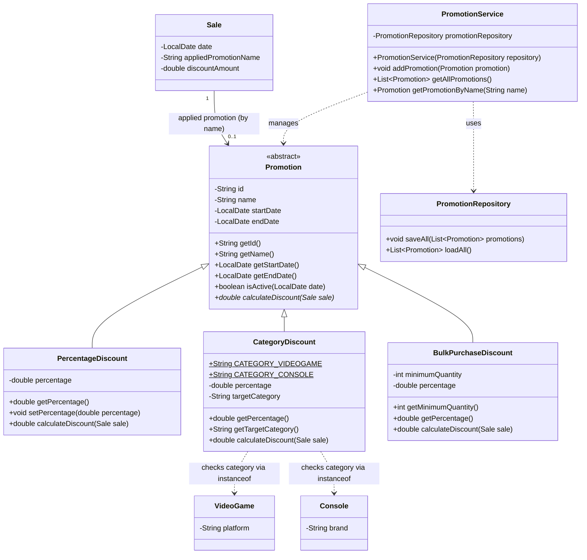

```mermaid
classDiagram
    class Promotion {
        <<abstract>>
        -String id
        -String name
        -LocalDate startDate
        -LocalDate endDate
        +String getId()
        +String getName()
        +LocalDate getStartDate()
        +LocalDate getEndDate()
        +boolean isActive(LocalDate date)
        +double calculateDiscount(Sale sale)*
    }

    class PercentageDiscount {
        -double percentage
        +double getPercentage()
        +void setPercentage(double percentage)
        +double calculateDiscount(Sale sale)
    }

    class CategoryDiscount {
        +String CATEGORY_VIDEOGAME$
        +String CATEGORY_CONSOLE$
        -double percentage
        -String targetCategory
        +double getPercentage()
        +String getTargetCategory()
        +double calculateDiscount(Sale sale)
    }

    class BulkPurchaseDiscount {
        -int minimumQuantity
        -double percentage
        +int getMinimumQuantity()
        +double getPercentage()
        +double calculateDiscount(Sale sale)
    }

    class Sale {
        -LocalDate date
        -String appliedPromotionName
        -double discountAmount
    }

    class VideoGame {
        -String platform
    }

    class Console {
        -String brand
    }

    class PromotionRepository {
        +void saveAll(List~Promotion~ promotions)
        +List~Promotion~ loadAll()
    }

    class PromotionService {
        -PromotionRepository promotionRepository
        +PromotionService(PromotionRepository repository)
        +void addPromotion(Promotion promotion)
        +List~Promotion~ getAllPromotions()
        +Promotion getPromotionByName(String name)
    }

    Promotion <|-- PercentageDiscount
    Promotion <|-- CategoryDiscount
    Promotion <|-- BulkPurchaseDiscount

    Sale "1" --> "0..1" Promotion : applied promotion (by name)
    CategoryDiscount ..> VideoGame : checks category via instanceof
    CategoryDiscount ..> Console : checks category via instanceof
    PromotionService ..> PromotionRepository : uses
    PromotionService ..> Promotion : manages
```