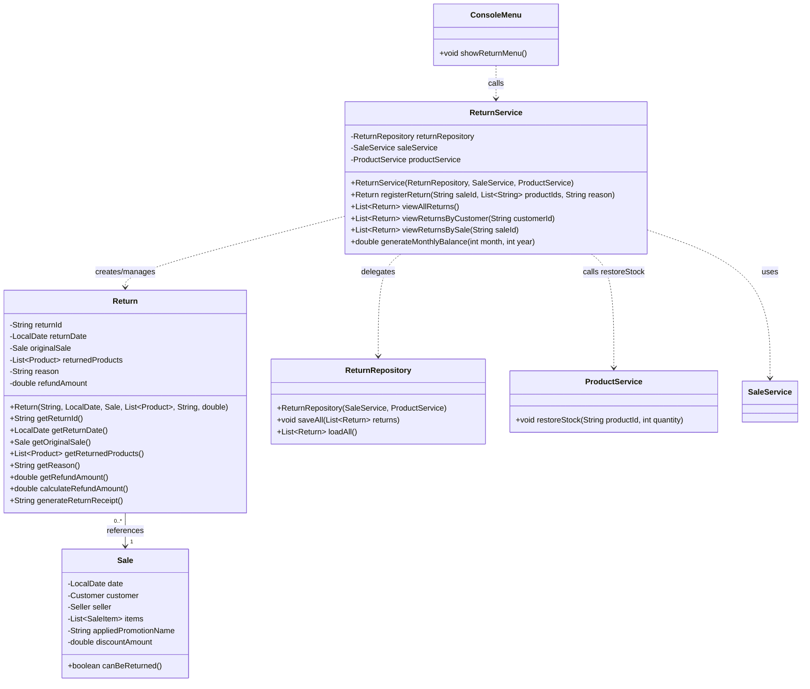

```mermaid
classDiagram
    class Return {
        -String returnId
        -LocalDate returnDate
        -Sale originalSale
        -List~Product~ returnedProducts
        -String reason
        -double refundAmount
        +Return(String, LocalDate, Sale, List~Product~, String, double)
        +String getReturnId()
        +LocalDate getReturnDate()
        +Sale getOriginalSale()
        +List~Product~ getReturnedProducts()
        +String getReason()
        +double getRefundAmount()
        +double calculateRefundAmount()
        +String generateReturnReceipt()
    }
    
    class Sale {
        -LocalDate date
        -Customer customer
        -Seller seller
        -List~SaleItem~ items
        -String appliedPromotionName
        -double discountAmount
        +boolean canBeReturned()
    }
    
    class ReturnRepository {
        +ReturnRepository(SaleService, ProductService)
        +void saveAll(List~Return~ returns)
        +List~Return~ loadAll()
    }
    
    class ReturnService {
        -ReturnRepository returnRepository
        -SaleService saleService
        -ProductService productService
        +ReturnService(ReturnRepository, SaleService, ProductService)
        +Return registerReturn(String saleId, List~String~ productIds, String reason)
        +List~Return~ viewAllReturns()
        +List~Return~ viewReturnsByCustomer(String customerId)
        +List~Return~ viewReturnsBySale(String saleId)
        +double generateMonthlyBalance(int month, int year)
    }
    
    class ProductService {
        +void restoreStock(String productId, int quantity)
    }
    
    class ConsoleMenu {
        +void showReturnMenu()
    }

    Return "0..*" --> "1" Sale : references
    ReturnService ..> ReturnRepository : delegates
    ReturnService ..> SaleService : uses
    ReturnService ..> ProductService : calls restoreStock
    ReturnService ..> Return : creates/manages
    ConsoleMenu ..> ReturnService : calls
```
