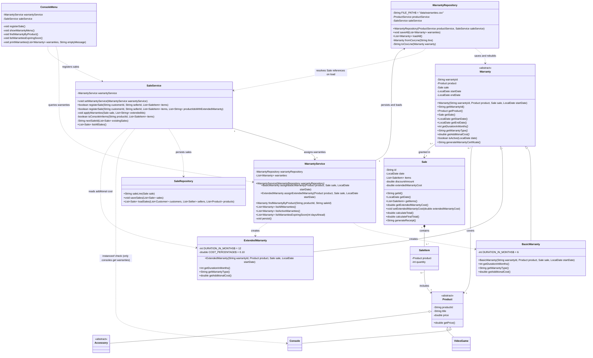

# Warranty Module - Class Diagram

Updated class diagram showing the new warranty hierarchy (`model`), the persistence and service classes of the module, and how the module is integrated with the existing system (`Sale`, `Product`, `Console`, `SaleService`, `ConsoleMenu`).

